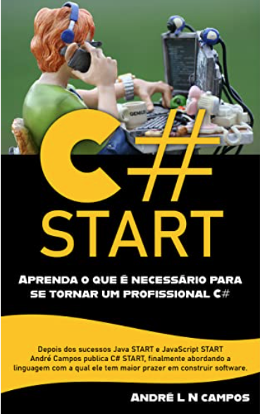

### C# Start - Book Exercises Code - André L M Campos - Amazon Kindle:

<h2 align="center"> 
  Simple Project C# - Book C# Start 
</h2>

<<<<<<< HEAD
  
=======
  
>>>>>>> 7a122a00f2f4dbfa8ba61b5ed2f7a562c54d7a73

<blockquote align="center">“Always evolving and learning more every day!”</blockquote>

### Book information
See more here: [Amazon Store](https://www.amazon.com/Start-Portuguese-Andr%C3%A9-LN-Campos-ebook/dp/B09LVQYHPN).

### Know more about me!

  https://www.linkedin.com/in/alexgomesnet/

### License:

  [MIT](LICENSE)
